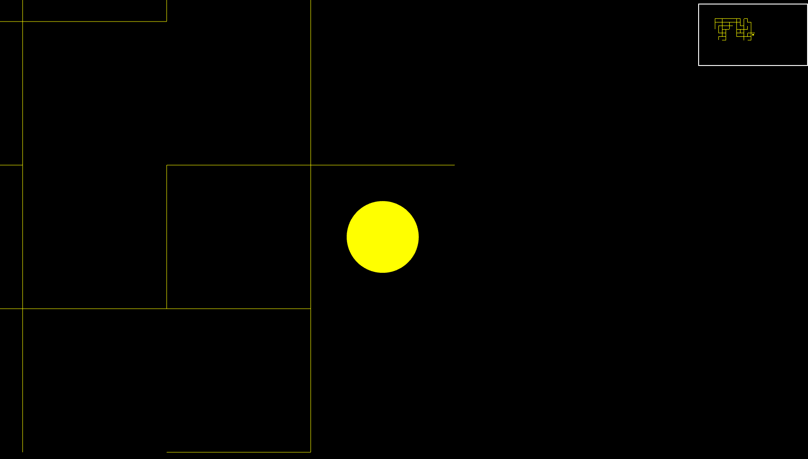

# TheMaze (not the AAA I expected)
<p align="center">
  
</p>

🕹️ **An old hobby project from years ago, now modernized and functional again!**

A simple maze exploration game originally built with C++11, SFML, and Qt5. This was a weekend coding experiment that got lost in time - now resurrected with modern build tools and clean project structure.

Navigate through a maze while revealing the map as you explore. Nothing fancy, just pure nostalgic fun!

## Features

- First-person maze exploration with arrow key controls
- Minimap showing visited areas
- Smooth camera movement with breathing effect
- Fullscreen gameplay

## Requirements

- C++11 compatible compiler (GCC 4.8+, Clang 3.3+)
- SFML 2.3+ (Simple and Fast Multimedia Library)
- Qt5 Core (for build system)
- Linux distribution with graphical environment

## Quick Start

```bash
# Everything in one command:
./game.sh

# Or step by step:
./game.sh setup    # Install dependencies
./game.sh build    # Build the game
./game.sh run      # Run the game
./game.sh clean    # Clean build files
```

## Manual Build

```bash
# Install dependencies (Ubuntu/Debian)
sudo apt-get update
sudo apt-get install -y build-essential libsfml-dev qtbase5-dev

# Build the project
make

# Run the game
./TheMaze
```

## Controls

- **Arrow Keys**: Move through the maze
- **ESC**: Exit the game

## Project Structure

```
TheMaze/
├── main.cpp          # Entry point
├── TheMaze.cpp       # Main game logic
├── TheMaze.hpp       # Game class header
├── CMaze.cpp         # Maze generation/loading
├── CMaze.hpp         # Maze data structures
├── default.maze      # Default maze file
├── Makefile          # Build configuration
├── game.sh           # Universal setup/build/run script
├── build/            # Build directory (created automatically)
└── README.md         # This file
```

## Architecture

The game uses a simple (read: naive) architecture:
- `TheMaze` class inherits from `sf::RenderWindow` and manages the game loop
- `CMaze` class handles maze data and wall detection
- Player movement is grid-based with collision detection
- Minimap is rendered to a separate texture and displayed in the corner

## What Got Modernized

This project was originally built on Windows with hardcoded paths and old build systems. Here's what was updated:

- ✅ **Portable build system** - Works on any Linux distribution
- ✅ **Clean project structure** - No more scattered build artifacts
- ✅ **Modern tooling** - Unified setup/build/run script
- ✅ **Proper dependency management** - Automatic package installation
- ✅ **Cross-platform Makefile** - No more Windows-specific paths
